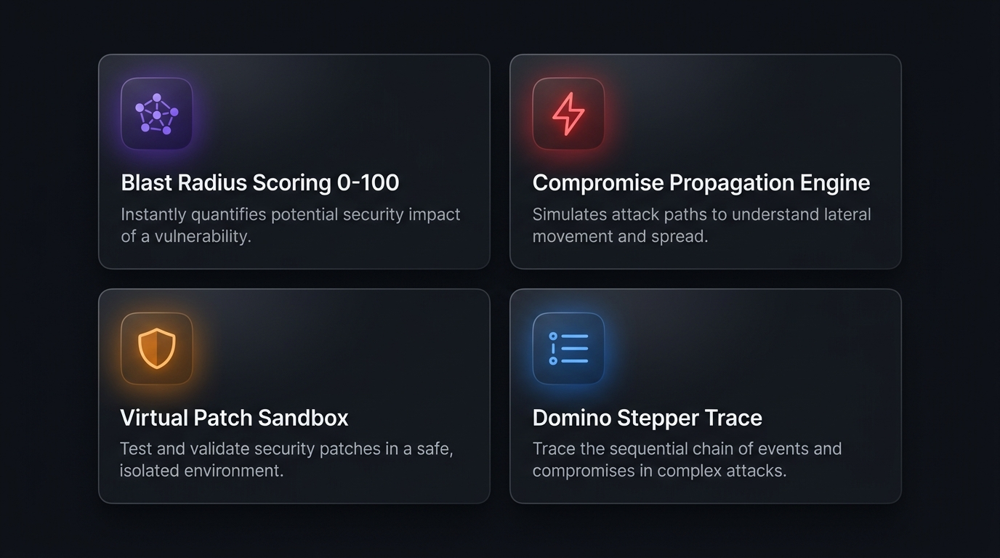
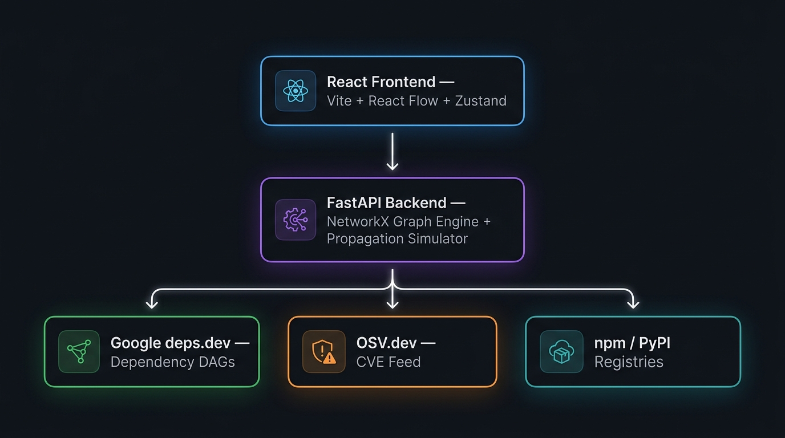

<div align="center">


<br/>
<br/>

**See the compromise before it becomes a catastrophe.**

<br/>

[](https://reactjs.org/)
[](https://vitejs.dev/)
[](https://fastapi.tiangolo.com/)
[](https://python.org/)
[](https://networkx.org/)
[](./LICENSE)

<br/>

[](/)
[](/)
[](/)

<br/>

[**🚀 Live Demo**](#) · [**📖 Docs**](./docs/) · [**🐛 Report Bug**](https://github.com/Swapnil-Ghosh06/RippleGuard/issues) · [**✨ Request Feature**](https://github.com/Swapnil-Ghosh06/RippleGuard/issues)

</div>

---

## ⚡ What is RippleGuard?

> *You rely on hundreds of packages every day — and you have zero visibility into what happens when one goes rogue.*

Standard vulnerability scanners give you a raw list of 400 CVE alerts and no idea which one could actually cripple your infrastructure. They alert on package versions, but **cannot map reachability, transitive blast paths, or downstream impact.**

**RippleGuard is different.** It's a **supply chain compromise simulator** — not an alert fatigue engine. You pick any package in the dependency tree, inject a real-world attack, and **watch the infection cascade across the dependency graph in real time.**

<br/>

<div align="center">

```
You name a package  →  We map its entire dependency universe
                   →  You inject a compromise
                   →  We calculate the blast radius
                   →  You see exactly what breaks and why
```

</div>

---

## ✨ Core Features



<br/>

| Feature | Description |
|---|---|
| 🕸️ **Live Dependency DAGs** | Recursive transitive dependency resolution for any npm or PyPI package in seconds via `deps.dev` |
| 💥 **Blast Radius Score (0–100)** | Quantitative impact metric combining affected packages, depth, monthly downloads & exploit severity |
| ⚡ **Compromise Propagation Engine** | Exponential decay contagion algorithm — watch malicious payloads spread node-by-node in real time |
| 🦋 **Domino Stepper** | Step-by-step scrubber tracing the critical failure chain with auto-centering camera focus |
| 🛡️ **Virtual Patch Sandbox** | Simulate removing, upgrading, or isolating packages and see blast radius shrink live |
| 🎯 **Attack Benchmarks** | One-click replays of Log4Shell, XZ Backdoor, event-stream, colors, and lodash CVEs |
| 📋 **Remediation Planner** | Prioritized upgrade paths with exact copy-paste `npm update` / `pip install --upgrade` commands |
| 📄 **Executive Export** | Downloadable JSON & Markdown SBOM audit summaries |

---

## 🎬 See It In Action

<table>
  <tr>
    <td align="center" width="50%">
      <strong>🔍 Search & Analyze Any Package</strong><br/>
      Type any npm or PyPI package name. RippleGuard builds a live dependency graph showing all transitive relationships and known CVEs.
    </td>
    <td align="center" width="50%">
      <strong>💥 Inject a Compromise</strong><br/>
      Click any node, hit "Inject Compromise", and watch the blast cascade spread node-by-node across the entire tree.
    </td>
  </tr>
  <tr>
    <td align="center" width="50%">
      <strong>🦋 Trace the Domino Path</strong><br/>
      Use the step-by-step Domino Stepper to walk through the critical failure chain with the camera auto-centering on each hop.
    </td>
    <td align="center" width="50%">
      <strong>🛡️ Patch & Measure Impact</strong><br/>
      Apply virtual patches in the sandbox and instantly see how much blast radius each fix eliminates.
    </td>
  </tr>
</table>

---

## 🏗️ Architecture



<br/>

### How the Contagion Formula Works

RippleGuard uses an **exponential decay propagation model** to simulate how a compromise spreads through a dependency graph:

$$P(v) = P(u) \cdot e^{-\lambda \cdot d} \cdot W_{\text{vuln}}(v)$$

| Symbol | Meaning |
|---|---|
| `P(v)` | Contagion probability at node `v` |
| `P(u)` | Contagion probability at parent node `u` |
| `λ` | Attenuation constant (role: Direct vs Transitive dependency) |
| `d` | Graph distance from the initial compromise point |
| `W_vuln(v)` | Vulnerability weight from CVSS v3 score & exploit maturity |

---

## 🎯 Attack Benchmarks

Replay five of the most devastating real-world supply chain attacks with one click:

| Attack | Package | CVE | Impact |
|---|---|---|---|
| 🔥 **Log4Shell RCE** | `log4js` | CVE-2021-44228 | Remote code execution via log interpolation |
| 🐚 **SSH Binary Backdoor** | `xz` | CVE-2024-3094 | Malicious XZ compression library compromising SSH |
| 💸 **Wallet Theft Trojan** | `event-stream` | GHSA-mh6f-8j2x-4483 | Malicious package injected to steal Bitcoin |
| 🎨 **Maintainer Sabotage** | `colors` | GHSA-5rqg-jm4f-cqx7 | Deliberate breakage by burned-out maintainer |
| 🧬 **Prototype Pollution** | `lodash` | CVE-2021-23337 | Object prototype poisoning across Node.js apps |

---

## 🚀 Getting Started

### Prerequisites

- **Node.js** v18+ & npm
- **Python** 3.10+ & pip
- **Zero API keys required** — all data providers are free and keyless

---

### 1️⃣ Clone the Repository

```bash
git clone https://github.com/Swapnil-Ghosh06/RippleGuard.git
cd RippleGuard
```

---

### 2️⃣ Backend Setup

```bash
cd backend

# Create virtual environment
python -m venv venv

# Activate it
source venv/bin/activate        # macOS / Linux
.\venv\Scripts\activate         # Windows

# Install dependencies
pip install -r requirements.txt

# Start the API server
uvicorn main:app --host 127.0.0.1 --port 8000 --reload
```

> **API live at:** `http://127.0.0.1:8000`  
> **Swagger docs:** `http://127.0.0.1:8000/docs`

---

### 3️⃣ Frontend Setup

```bash
cd frontend

# Install dependencies
npm install

# Copy env config
cp .env.example .env.local
# .env.local already points to http://localhost:8000 by default

# Start dev server
npm run dev
```

> **App live at:** `http://localhost:5173`

---

## 📡 API Reference

| Method | Endpoint | Description |
|---|---|---|
| `GET` | `/health` | Service health status & API version |
| `POST` | `/api/analyze` | Resolves transitive deps & queries OSV vulnerabilities |
| `POST` | `/api/simulate` | Executes blast radius calculation & contagion propagation |
| `POST` | `/api/compare` | Compares blast radius between versions or packages |
| `POST` | `/api/export` | Generates downloadable JSON / Markdown summaries |
| `GET` | `/api/attacks` | Returns curated historical attack scenarios |

---

## 🛠️ Tech Stack

<div align="center">

| Layer | Technology |
|---|---|
| **Frontend Framework** | React 18 + Vite |
| **Graph Visualization** | React Flow (`@xyflow/react`) |
| **State Management** | Zustand |
| **Animations** | Framer Motion |
| **Styling** | Tailwind CSS |
| **Typography** | Playfair Display · DM Sans · Sora |
| **Backend Framework** | FastAPI (Python 3.11) |
| **ASGI Server** | Uvicorn |
| **Graph Processing** | NetworkX |
| **HTTP Client** | HTTPX (async) |
| **Validation** | Pydantic v2 |
| **Dependency Data** | Google deps.dev API |
| **Vulnerability Data** | OSV.dev Advisory Database |
| **Package Registries** | npm Registry API · PyPI JSON API |

</div>

---

## 📚 Documentation

All design & specification docs live in [`docs/`](./docs/):

| Doc | Description |
|---|---|
| [`PRD.md`](./docs/PRD.md) | Product vision, core features, judging criteria mapping |
| [`ARCHITECTURE.md`](./docs/ARCHITECTURE.md) | System architecture, request lifecycle, data flow |
| [`TECHSTACK.md`](./docs/TECHSTACK.md) | Technology choices & library rationale |
| [`DATA_MODEL.md`](./docs/DATA_MODEL.md) | Entity relationships — Package, Vulnerability, BlastResult |
| [`SCHEMA.md`](./docs/SCHEMA.md) | API request & response specifications |
| [`DESIGN.md`](./docs/DESIGN.md) | Color palette, typography tokens, motion system |
| [`TDD.md`](./docs/TDD.md) | Technical design — propagation algorithms & DAG parsing |

---

## 👥 The Team

<div align="center">

| | Contributor | Role | Focus |
|---|---|---|---|
| 🧠 | **Syed Zahid Saleem** · [@syedzahidsaleem](https://github.com/syedzahidsaleem) | Backend Lead | Graph Engine, FastAPI Architecture, DAG Resolution |
| 🔬 | **Haripriya** · [@Haripriya24071](https://github.com/Haripriya24071) | Backend | OSV & Registry Integration, Vulnerability Scoring |
| 🎨 | **Swapnil Ghosh** · [@Swapnil-Ghosh06](https://github.com/Swapnil-Ghosh06) | Frontend | Design System, Frontend Architecture, Layout |
| 🖥️ | **Shubham** · [@subham-OPS08](https://github.com/subham-OPS08) | Frontend | Graph Visualization, Node Ports, Canvas Interactions |
| 🎭 | **Nitya** · [@dearnitya](https://github.com/dearnitya) | Frontend & UI | Analysis Panels, Domino Stepper HUD, Mitigation UI |

</div>

---

## 📄 License

This project is licensed under the **MIT License** — see the [LICENSE](LICENSE) file for details.

---

<div align="center">

Built with ❤️ for **Manipal Hackathon 2026** — Cybersecurity Track

<br/>

*RippleGuard — Because one rogue package can sink everything.*

<br/>

⭐ **Star this repo** if you found it useful!

</div>
